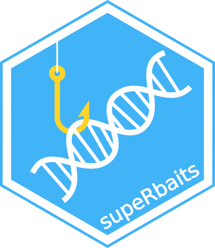

# supeRbaits

## An R-package to design baits for capture sequencing experiments 

## What can supeRbaits help you with?
You are a researcher/lab manager wanting to carry out a capture sequencing experiment, where you want to design your own set of baits from a genome sequence of your species of interest. The R-package supeRbaits, written in R and C++ and implemented in R, can help you with this task.

### How to start:
**Installation:**
```
# install and load devtools, the package to allow you 
# to install packages hosted in github
install.packages("devtools")
require("devtools")

# install and load the package from the GitHub repo
install_github("BelenJM/supeRbaits")
require(supeRbaits)
```

### Main function and its options:
main() is the main function of the package. The different options are:

**1.Number of total baits (n)**
 
 With the n option, you can specify the number of total baits you would like to generate.
 
**2.Size of bait (size)**

Desired size of each of the baits to generate. An example: 120 base pairs.
 
**3.Genomic dataset to use as a reference (database)**

The genomic information available from the species of interest that you want the baits to be designed from. The database can be of any format, and it can be at a chromosome or contig level. 

**4.Areas of the database to exclude (exclusions)**

Use this option if you want to exclude certain areas from your genomic database and not generate baits from those. An example would be to exclude areas with a specific GC content, or repeated regions, depending on the type of analysis you are interested in performing. 

**5.Areas of the database that you want to specifically include (regions)**

This option allows you to specify regions of the genomic database that you are very interested in including within your baits. A region file could be a set of genes, where for each gene you have an interval of base pairs where you are interested in having baits designed from. As with the targets option (see below), you have the opportunity to include tiling (regions.tiling), i.e.design x number of baits in each specific region, or proportion (regions.prop) where you select the proportion of baits from the total baits (n) that you want to be designed in regions.

**6.Points of the database that you want to include (targets)**

You can include another type of regions of interest where you want some baits to be designed from. Targets would typically consist on Single Nucleotide Polymorphisms (SNP) where you know the position at the genomic database where they are located, and you want to design a bait from such area. As with the regions option (see above), you have the opportunity to include tiling (targets.tiling), i.e.design x number of baits in each specific target, or proportion (targets.prop) where you select the proportion of baits from the total baits (n) that you want to be designed in targets.

**7.Seed (seed)**

You can specify a seed number in order to reproduce your bait design. 

**8.Areas of the database that you want to restrict your baits to (restrict)**

Specific areas where you don't want your baits to fall over.

**9.GC content (gc)**

Specific range of % of the nucleotides Guanine and Cytosine (GC) within your bait area where you want the baits to fall within. An example is to limit the GC content of your baits between 35 to 55% within the bait area, as having a lower/higher content may make your bait not to work well during the experiment.

**10.Verbose option (verbose)**
