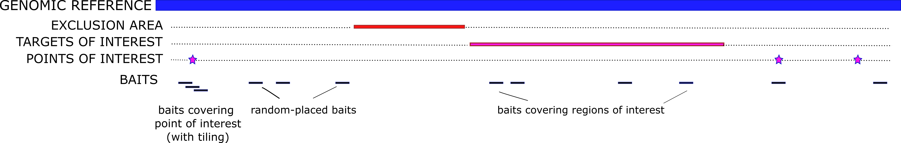
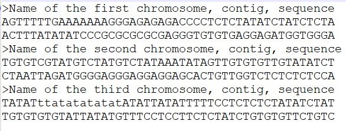
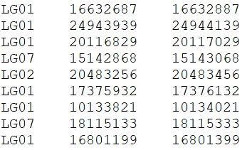
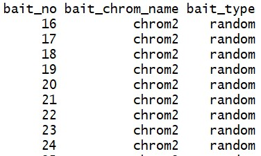
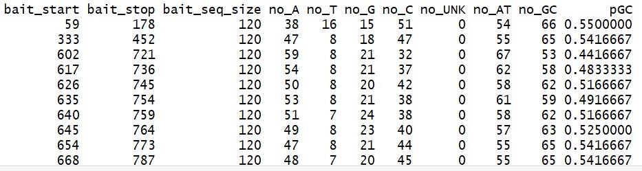

```{r setup, include=FALSE}
knitr::opts_chunk$set(echo = TRUE,out.width="400px", dpi=120)
```

## supeRbaits
### An R-package to design baits for capture sequencing experiments

This package was designed to help researchers/lab managers wanting to cary out capture sequencing experiments. The R-package supeRbaits, written in R and C++ and implemented in R, can help design your own set of baits from a genome sequence of your species of interest.

####How to start:

**Installation:**

```{r, eval=FALSE}
# install and load remotes , which allows
# to install packages hosted in github

install.packages("remotes")
library("remotes")
```

####supeRbaits' main concepts for bait design

Before starting, we recommend users to read the following manuscript where supeRbaits was originally described in, where you can find useful information to guide you through the process of designing baits and what considerations to take. You can use this article as citation for when using supeRbaits too:

*Jimenez-Mena, B.; Flavio, H.; Henriques, R.; Manuzzi, A.; Ramos, M.; Meldrup, D.; Edson, J.; Ovenden, J., Palsson , S.; Olafsdottir, G.A; Nielsen, E.E Fishing for DNA? Designing baits for population genetics in target enrichment experiments: guidelines, considerations and the new tool supeRbaits. To be submitted to Molecular Ecology Resources*

To work with supeRbaits, you must understand its underlying terminology. When designing baits, one is typically interested in using a genomic reference of some sort (i.e. the "database", in supeRbaits' terms); which in an ideal scenario is a reference genome. However, this genomic reference can also be an assembly, transcriptome or any other genomic resources available for the species of interest. If there is no genomic reference available for the species under consideration for bait design, one can also consider resources from a close-related species, if available.

Once we have located a genomic reference, we want to start designing our baits. Ideally, one would have some knowledge about areas of the genome that should be avoided (*i.e.* the "exclusions"), and others that may be of interest (*i.e.* the "regions" and/or "targets"). Besides placing baits where we have some prior information, we could also place baits randomly across the database. If we do not have any prior knowledge about our species' genome, we can still design baits using entirely the random approach.

The user can define the percentage of the total baits to be designed in the regions and targets of interest, as well as how much tiling to include in each target/region. If the percentage of each type of regions and targets of interest does not amount to 100%, supeRbaits will fill the remaining baits with randomly-placed baits along the genome (always avoiding the exclusion zones). Depending on the baits' purpose, one could choose to divide the bait panel into different (smaller) set of baits, and focus on the design of baits in different types of targets of interests.

Here we can find a schematic figure on how the different components within supeRbaits are used to design a set of baits:

{width=90%}

## supeRbaits' main function and arguments:

*do_baits()* is the main function of the package. This function has a set of different arguments that the user can use to create the set of baits:

### 1. Number of total baits (*n*), number of baits per sequence (*n.per.seq*) and minimum number of baits per sequence (*min.per.seq*)

These arguments relate to the number of baits to be generated and the conditions.
With the n option, you can specify the **overall** number of total baits you would like to generate in your bait set. The baits will be distributed around the sequences proportionally to the sequences' size. If you plan to design more than 100000, we recommend that you divide the sequences in various sets for memory reasons (otherwise, supeRbaits could complain (or more importantly, your computer may crash!).

The argument *n.per.seq* indicates the number of baits that the user wants to include in each of the sequences of the FASTA input file, *i.e* chromosome or alike. When possible, this argument will generate the same number of baits to all sequences. The argument *min.per.seq* will establish the minimum number of baits to be placed per each of those sequences. The default is 1.

Note: You cannot use *n* and *n.per.seq* simultaneously.

### 2. Size of bait (*size*)

Desired size of each of the baits to generate. An example: 120 base pairs.


### 3. Genomic dataset to use as a reference (*database*)

The genomic information available from the species of interest that you want to use as a reference for the designed baits. This reference database should be in FASTA format. See more information about the FASTA format here <www.ncbi.nlm.nih.gov/BLAST/fasta.html>). For each entry, the FASTA format consists of at least two lines: one introduced by ">" and followed by a string (with the name of that chromosome, contig or piece of sequence of DNA), and the following lines containing the genomic sequence (*'ATTTCAGGGTATGG'*). Hence forth, each individual entity in a database file is called a "sequence".

{width=50%}

Note that we have implemented a function within the package, *i.e. standardize_lengths()*, that makes sure that the sequences are properly organised in the FASTA file.

### 4. Areas of the database to exclude (*exclusions*)

Use this option if you want to exclude certain areas from your genomic database and not generate baits from those. An example would be to exclude areas with a specific GC content, or repeated regions, depending on the type of analysis you are interested in performing.

To use *exclusions*, you need to provide an input file with the first three columns of a BED type format, *i.e.*
**Chromosome_name** (tab) **start_bp** (tab) **end_bp** (endline), where the first column represents the chromosome/contig name (same names used in the database), and the second and third column represent the bp where the exclusion region starts and end. Each row contains a separate exclusion region. This file does not require column headers, and the data should be separated by tabs. 

An example of the input file can be found below:

{width=35%}

### 5. Areas of the database that you want to specifically include (*regions*)

This option allows you to specify regions of the genomic database that you are interested in including within your baits. Additionally, you have the opportunity to include tiling using the argument *regions.tiling*, and the proportion of baits from the total baits (*n*) that you want to be designed in regions, using the argument *regions.prop*.

A region input file is structured in the same format as to the exclusions' input file, where for each gene you have one or more intervals of base pairs you are interested in. The input file requires a BED-type file, with three columns, *i.e.* **Chromosome_name** (tab) **start_bp** (tab) **end_bp** (endline)

Each row contains a single region of interest.

### 6. Base pairs of the database that you want to include (*targets*)

You can also include single targets of interest where you want some baits to be designed for. Targets would typically consist on Single Nucleotide Polymorphisms (*SNP*) where you know their position at the genomic database, and you want to design a bait that captures specifically that base pair. 

As with the regions option (see above), you have the opportunity to include tiling (*targets.tiling*), *i.e.* design a set number of baits in each specific target, and the proportion of baits from the total baits (*n*) that you want to be designed in targets (*targets.prop*).

If you want to use this option (*targets*), an input file with two columns needs to be 
provided, *i.e.* **Chromosome_name** (tab) **location_base_pair** (endline), where the first column represents the chromosome/contig name (same names used in the database used in point 3), and the second column represents the base pair where the SNP is located. Each row contains a separate target.

### 7. Reproducibility (*seed*)

There is always a degree of randomness in bait design, even when you use *exclusion*, *regions* or *targets*. To ensure that you receive the same results twice (*e.g.* for reproducibility purposes), you can specify a seed number to fix the random mechanisms and ensure the same output on multiple runs.

### 8. Areas of the database that you want to restrict your baits (*restrict*)

A vector of chromosome names OR position numbers to which the analysis should be restricted to. This argument allows supeRbaits to only design baits for specific genes, specified either by name or position on the database.

### 9. GC content (*gc*)

Range of % of the nucleotides Guanine and Cytosine (GC) allowed for a bait. This means that baits outside the specific range will be directly discarded. In general it is recommended to keep the GC content of your baits within intermediate content (*e.g.* between 35 to 55%), as having a lower/higher content may make your bait not to work well during the experiment.

### 10. Messages from supeRbaits (*verbose*)

If TRUE, the messages during the bait design process within supeRbaits will be displayed, per sequence. The default is FALSE.

### 11. "Forcing" supeRbaits (*force*) 

Generally supeRbaits is recommended to not design more than 100K baits at the same time (*n > 100K*). Designing more than 100K baits on one go is still possible, however, you need to indicate to supeRbaits this is what you want by indicating *force=TRUE*. supeRbaits will show a warning message stating that it will proceed to run even if the number of baits requested is very large, and that your machine may run out of memory attempting to extract all the baits.

## The output: your set of baits

For each sequence in the database file, supeRbaits provides an output with the bait number and the bait type, that will let you know if the designed sequence is a "random", "target" or "region" bait. 

{width=35%}

In addition, supeRbaits provides a summary of the elements of the bait, *e.g.* start and end position (in base pairs; *i.e.* *bait_start* and *bait_stop*); the length of the bait (*bait_seq_size*); counts of each nucleotide type (*no_A*; *no_T*; *no_G*; *no_C*), unknown bases (*no_UNK*), counts of AT (*no_AT*) or GC (*no_GC*) and percentage of GC content (*pGC*).

{width=90%}

These outputs can be used for further filtering in R or exported as a table and used as input for next steps in the bait design process, either using R or other software.
